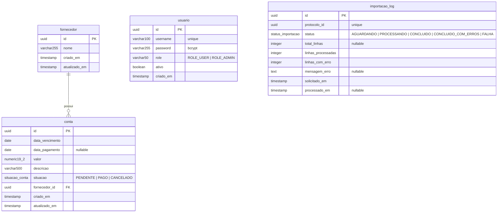

# API de Gestão de Contas a Pagar

API REST para gestão de contas a pagar com importação assíncrona via RabbitMQ, autenticação JWT e arquitetura DDD.

## Stack

| Tecnologia | Versão |
|---|---|
| Java | 17 |
| Spring Boot | 3.2.3 |
| PostgreSQL | 16 |
| Flyway | (Spring Boot managed) |
| RabbitMQ | 3.13 |
| Spring Security + JWT (jjwt) | 0.12.5 |
| SpringDoc OpenAPI | 2.3.0 |
| Docker Compose | — |

---

## Como executar

### Pré-requisitos
- Docker e Docker Compose instalados

### Subir o ambiente completo

```bash
docker-compose up -d --build
```

Aguarde os health checks de PostgreSQL e RabbitMQ passarem. A aplicação ficará disponível em:

- **API**: http://localhost:4021
- **Swagger UI**: http://localhost:4021/swagger-ui.html
- **RabbitMQ Management**: http://localhost:4024 (guest/guest)

### Parar

```bash
docker-compose down
```

---

## Autenticação

Todos os endpoints (exceto `/api/auth/**`) exigem token JWT no header:

```
Authorization: Bearer <token>
```

> **Recomendado**: use os arquivos `.http` da pasta `testes/` (VS Code + extensão REST Client ou IntelliJ nativo) — são mais práticos e já têm tudo preenchido.
>
> Os exemplos `curl` abaixo usam formato de **linha única** compatível com Windows (CMD/PowerShell) e Linux/Mac.

### 1. Registrar usuário

> A migração `V5` já cria o usuário `admin / admin123`. Só use este endpoint se quiser criar um usuário adicional.

```
curl -X POST http://localhost:4021/api/auth/registro -H "Content-Type: application/json" -d "{\"username\": \"avaliador\", \"password\": \"senha123\"}"
```

### 2. Obter token

```
curl -X POST http://localhost:4021/api/auth/login -H "Content-Type: application/json" -d "{\"username\": \"admin\", \"password\": \"admin123\"}"
```

Resposta:
```json
{
  "accessToken": "eyJhbGciOiJIUzI1NiJ9...",
  "tokenType": "Bearer",
  "expiresIn": 86400000
}
```

Salve o token para usar nos próximos exemplos — substitua `SEU_TOKEN` pelo valor de `accessToken`.

---

## Exemplos de chamadas

### Fornecedores

**Criar fornecedor**
```
curl -X POST http://localhost:4021/api/fornecedores -H "Authorization: Bearer SEU_TOKEN" -H "Content-Type: application/json" -d "{\"nome\": \"Energia SA\"}"
```

**Listar fornecedores (paginado)**
```
curl http://localhost:4021/api/fornecedores?page=0^&size=10 -H "Authorization: Bearer SEU_TOKEN"
```
> No CMD o `&` precisa ser escapado com `^`. No PowerShell e Linux use `&` diretamente (entre aspas duplas se necessário).

---

### Contas a Pagar

**Criar conta** (use o UUID do fornecedor padrão já criado pela migração V6)
```
curl -X POST http://localhost:4021/api/contas -H "Authorization: Bearer SEU_TOKEN" -H "Content-Type: application/json" -d "{\"dataVencimento\": \"2025-09-01\", \"valor\": 350.00, \"descricao\": \"Conta de energia\", \"fornecedorId\": \"586443e5-446b-4a0e-88a3-0e6393a550be\"}"
```

**Listar contas com filtros**
```
curl "http://localhost:4021/api/contas?dataVencimentoInicio=2025-01-01&dataVencimentoFim=2025-12-31&page=0&size=20" -H "Authorization: Bearer SEU_TOKEN"
```

**Alterar situação para PAGO** (substitua `UUID_DA_CONTA`)
```
curl -X PATCH http://localhost:4021/api/contas/UUID_DA_CONTA/situacao -H "Authorization: Bearer SEU_TOKEN" -H "Content-Type: application/json" -d "{\"situacao\": \"PAGO\", \"dataPagamento\": \"2025-08-10\"}"
```

**Relatório de total pago por período**
```
curl "http://localhost:4021/api/contas/relatorio/total-pago?inicio=2025-01-01&fim=2025-12-31" -H "Authorization: Bearer SEU_TOKEN"
```

---

### Importação CSV

**Formato do arquivo CSV:**
```
data_vencimento,data_pagamento,valor,descricao,fornecedor_id
2025-09-01,,500.00,Conta de água,586443e5-446b-4a0e-88a3-0e6393a550be
2025-09-15,2025-09-10,200.00,Internet,586443e5-446b-4a0e-88a3-0e6393a550be
```

**Upload do CSV** (Linux/Mac):
```bash
curl -X POST http://localhost:4021/api/importacao/csv -H "Authorization: Bearer SEU_TOKEN" -F "arquivo=@testes/csv/csv_valido.csv"
```

**Upload do CSV** (Windows CMD/PowerShell):
```
curl -X POST http://localhost:4021/api/importacao/csv -H "Authorization: Bearer SEU_TOKEN" -F "arquivo=@testes\csv\csv_valido.csv"
```

Resposta (HTTP 202 Accepted):
```json
{
  "protocoloId": "550e8400-e29b-41d4-a716-446655440000",
  "status": "AGUARDANDO",
  "mensagem": "Arquivo recebido e enfileirado para processamento.",
  "solicitadoEm": "2025-09-01T14:30:00"
}
```

**Consultar status da importação** (substitua `PROTOCOLO_ID`):
```
curl http://localhost:4021/api/importacao/csv/PROTOCOLO_ID -H "Authorization: Bearer SEU_TOKEN"
```

---

## Testes

### Arquivos CSV de teste

Arquivos prontos em `testes/csv/` para usar com o endpoint de importação:

| Arquivo | Comportamento esperado |
|---|---|
| `csv_valido.csv` | 5 linhas corretas → `CONCLUIDO` |
| `csv_data_invalida.csv` | Datas em formato errado, mês 13, dia 30 em fevereiro → `CONCLUIDO_COM_ERROS` |
| `csv_valor_invalido.csv` | Valor negativo, zero, texto, overflow → `CONCLUIDO_COM_ERROS` |
| `csv_fornecedor_inexistente.csv` | UUID zerado, UUID inválido → `CONCLUIDO_COM_ERROS` |
| `csv_corrompido.csv` | Separadores errados, JSON no lugar de CSV → `CONCLUIDO_COM_ERROS` |
| `csv_apenas_cabecalho.csv` | Sem linhas de dados → `CONCLUIDO` (0 importadas) |
| `csv_colunas_faltando.csv` | Linhas com colunas ausentes → `CONCLUIDO_COM_ERROS` |
| `csv_misto_todos_erros.csv` | 6 erros + 1 linha válida → `CONCLUIDO_COM_ERROS` |

> **Os CSVs já estão prontos para uso**: a migração `V6` insere automaticamente um fornecedor padrão com o UUID `586443e5-446b-4a0e-88a3-0e6393a550be`. Todos os arquivos de teste já usam esse UUID — basta subir o ambiente e testar.

---

## Testes de Concorrência

### Por que concorrência importa neste projeto

O sistema tem dois pontos naturais de condição de corrida:

1. **RabbitMQ Consumer** — múltiplos uploads CSV processados simultaneamente no mesmo banco.
2. **Máquina de estados** — dois clientes podem tentar alterar a situação da mesma conta ao mesmo tempo (ex: PAGAR e CANCELAR simultaneamente).

### Executar os scripts de concorrência

```bash
# Pré-requisito: jq instalado
# Linux/Mac:
brew install jq   # macOS
apt install jq    # Ubuntu

# Dar permissão e rodar
chmod +x testes/concorrencia/*.sh

# Cenários gerais (race condition, criação massiva, leitura simultânea)
bash testes/concorrencia/teste_concorrencia.sh

# Cenários focados no Consumer RabbitMQ + CSV
bash testes/concorrencia/teste_concorrencia_csv.sh
```

### Os 4 cenários testados

**Cenário 1 — Uploads CSV simultâneos (5 paralelos)**
Verifica que cada upload recebe um `protocoloId` único e que todos chegam ao status `CONCLUIDO` sem interferência entre si.

**Cenário 2 — Race condition: PAGAR vs CANCELAR (mesma conta)**
Dois workers tentam simultaneamente alterar a situação da mesma conta. Resultado esperado:
- O primeiro a commitar: **HTTP 200**
- O segundo (que perdeu a corrida): **HTTP 422** com `TransicaoSituacaoInvalidaException`
- Nunca deve ocorrer **HTTP 500**

O `@Transactional` + isolamento `READ_COMMITTED` do PostgreSQL garante que o segundo worker vê o estado já alterado e a exceção de domínio é lançada corretamente.

**Cenário 3 — Criação massiva simultânea (10 contas em paralelo)**
Verifica que todas as 10 contas são criadas sem duplicação ou perda. O `gen_random_uuid()` do PostgreSQL garante unicidade de IDs mesmo sob concorrência.

**Cenário 4 — Leitura simultânea durante escrita**
5 leitores leem a mesma conta enquanto um escritor a atualiza. Nenhuma leitura deve retornar `situacao: null` ou estado corrompido — garantido pelo MVCC (Multi-Version Concurrency Control) do PostgreSQL.

### Proteções implementadas contra race conditions

| Proteção | Onde | O que previne |
|---|---|---|
| `@Transactional` nos use cases | Application layer | Operações incompletas visíveis para outros |
| Máquina de estados na entidade | Domain layer | Estado inválido após race condition |
| `gen_random_uuid()` no PostgreSQL | Banco de dados | Colisão de IDs em inserts simultâneos |
| Protocolo UUID único por upload | `ImportacaoController` | Dois uploads sobrescrevendo o mesmo log |

### Testes de carga com k6 (carga real)

Para simular dezenas de usuários simultâneos, instale o k6 e rode o script pronto:

```bash
# Instalar k6
winget install k6 --source winget   # Windows
brew install k6                     # macOS
# Linux: https://grafana.com/docs/k6/latest/set-up/install-k6/

# Rodar: 50 usuários virtuais tentando alterar a mesma conta por 10s
k6 run testes/concorrencia/k6_race_condition.js
```

**Resultado esperado**: ~1 requisição com HTTP 200, ~49 com HTTP 422, 0 com HTTP 500.

---

## Decisões arquiteturais

### DDD em camadas
O projeto segue a separação em quatro camadas:
- **`domain`** — entidades, enums, interfaces de repositório (portas) e exceções de domínio. Zero dependências externas.
- **`application`** — casos de uso, DTOs (Records Java). Orquestra o domínio sem conhecer a infraestrutura.
- **`infrastructure`** — implementações JPA, RabbitMQ, JWT, parsing CSV. Adapta o mundo externo ao domínio.
- **`api`** — controllers REST, handler de exceções, configuração OpenAPI. Traduz HTTP ↔ aplicação.

### Prevenção de N+1 (JPA)
- `findByIdWithFornecedor` usa `JOIN FETCH` para busca por ID.
- Listagem paginada usa `@EntityGraph(attributePaths = {"fornecedor"})` com `countQuery` separado — garante que a paginação seja correta e o fornecedor carregado eficientemente.

### Importação assíncrona resiliente
- A API recebe o CSV, persiste um `ImportacaoLog` (protocolo), publica no RabbitMQ e retorna HTTP 202 imediatamente.
- O consumer processa cada linha independentemente — falhas parciais não abortam o lote.
- Erros fatais disparam retry (3x) e enviam para a Dead Letter Queue.

### Validações em três camadas
- **Contrato** (Bean Validation): `@NotNull`, `@NotBlank`, `@DecimalMin` nos Records de request.
- **Fluxo** (Application): verificação de existência do fornecedor antes de criar/atualizar.
- **Domínio** (Entity): invariantes na própria entidade (valor positivo, máquina de estados de situação).

---

## Modelo de Dados

### Diagrama ER



### Tabelas e colunas

#### `fornecedor`
| Coluna | Tipo | Restrições |
|---|---|---|
| `id` | `UUID` | PK, `DEFAULT gen_random_uuid()` |
| `nome` | `VARCHAR(255)` | NOT NULL, UNIQUE (case-insensitive) |
| `criado_em` | `TIMESTAMP` | NOT NULL, DEFAULT NOW() |
| `atualizado_em` | `TIMESTAMP` | NOT NULL, DEFAULT NOW() |

#### `conta`
| Coluna | Tipo | Restrições |
|---|---|---|
| `id` | `UUID` | PK, `DEFAULT gen_random_uuid()` |
| `data_vencimento` | `DATE` | NOT NULL |
| `data_pagamento` | `DATE` | nullable |
| `valor` | `NUMERIC(19,2)` | NOT NULL, `CHECK (valor > 0)` |
| `descricao` | `VARCHAR(500)` | NOT NULL |
| `situacao` | `situacao_conta` | NOT NULL, DEFAULT `PENDENTE` |
| `fornecedor_id` | `UUID` | NOT NULL, FK → `fornecedor(id)` |
| `criado_em` | `TIMESTAMP` | NOT NULL, DEFAULT NOW() |
| `atualizado_em` | `TIMESTAMP` | NOT NULL, DEFAULT NOW() |

> **ENUM `situacao_conta`**: `PENDENTE` → `PAGO` ou `CANCELADO` (transições controladas pela entidade de domínio)

#### `usuario`
| Coluna | Tipo | Restrições |
|---|---|---|
| `id` | `UUID` | PK, `DEFAULT gen_random_uuid()` |
| `username` | `VARCHAR(100)` | NOT NULL, UNIQUE |
| `password` | `VARCHAR(255)` | NOT NULL (bcrypt) |
| `role` | `VARCHAR(50)` | NOT NULL, DEFAULT `ROLE_USER` |
| `ativo` | `BOOLEAN` | NOT NULL, DEFAULT TRUE |
| `criado_em` | `TIMESTAMP` | NOT NULL, DEFAULT NOW() |

#### `importacao_log`
| Coluna | Tipo | Restrições |
|---|---|---|
| `id` | `UUID` | PK, `DEFAULT gen_random_uuid()` |
| `protocolo_id` | `UUID` | NOT NULL, UNIQUE |
| `status` | `status_importacao` | NOT NULL, DEFAULT `AGUARDANDO` |
| `total_linhas` | `INTEGER` | nullable |
| `linhas_processadas` | `INTEGER` | DEFAULT 0 |
| `linhas_com_erro` | `INTEGER` | DEFAULT 0 |
| `mensagem_erro` | `TEXT` | nullable |
| `solicitado_em` | `TIMESTAMP` | NOT NULL, DEFAULT NOW() |
| `processado_em` | `TIMESTAMP` | nullable |

> **ENUM `status_importacao`**: `AGUARDANDO` → `PROCESSANDO` → `CONCLUIDO` / `CONCLUIDO_COM_ERROS` / `FALHA`

### Índices
| Tabela | Índice | Tipo | Finalidade |
|---|---|---|---|
| `fornecedor` | `idx_fornecedor_nome` | B-tree | Busca por nome |
| `fornecedor` | `idx_fornecedor_nome_unique` | B-tree UNIQUE em `LOWER(nome)` | Unicidade case-insensitive |
| `conta` | `idx_conta_data_vencimento` | B-tree | Filtros e ordenação por data |
| `conta` | `idx_conta_descricao` | GIN (tsvector) | Busca textual LIKE eficiente |
| `conta` | `idx_conta_situacao` | B-tree | Relatório de total pago |
| `conta` | `idx_conta_fornecedor` | B-tree | JOINs com fornecedor |
| `usuario` | `idx_usuario_username` | B-tree UNIQUE | Autenticação e unicidade de username |
| `importacao_log` | `idx_importacao_log_protocolo` | B-tree | Consulta de status por protocolo |


### Facilicade para pesquisar no banco
docker exec contas-pagar-postgres psql -U contas_user -d contas_pagar -c "SELECT * from usuaro;"  
docker exec contas-pagar-postgres psql -U contas_user -d contas_pagar -c "SELECT * from fornecedor;"  
docker exec contas-pagar-postgres psql -U contas_user -d contas_pagar -c "SELECT * from conta;" 